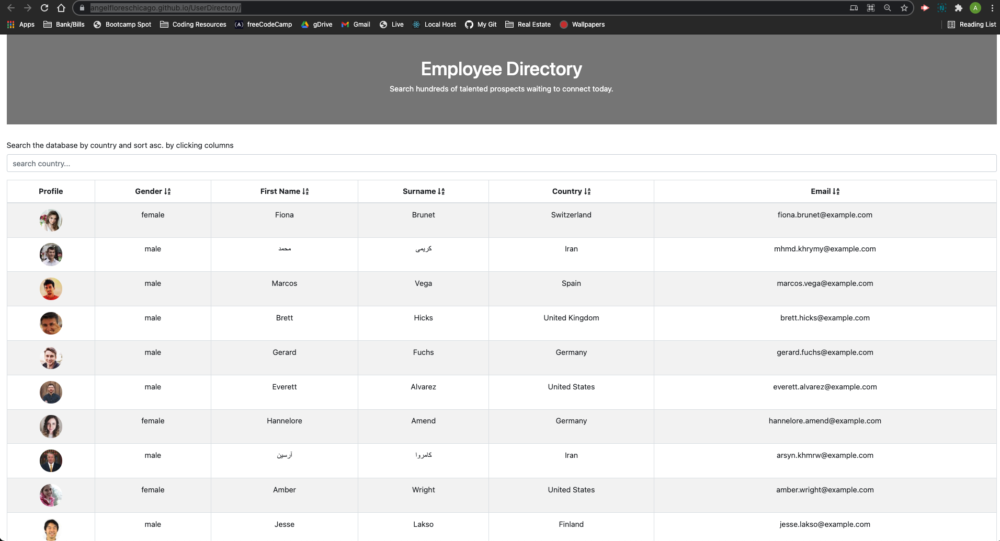

# User Employee Directory with React

## Description
    The User Directory App is designed for managers so that they are able to 
    view non-sensitive data about other employees. It is especially helpful 
    because the app is also able to filter employees by name.

## User Story
    - As a user, I want to be able to view my entire employee directory at once 
      so that I have quick access to their information.

## License

## Deployment
[Employee Directory ](https://angelfloreschicago.github.io/UserDirectory/)
This app is deployed live on GitHub Pages! (Click Link!)

## Demo
